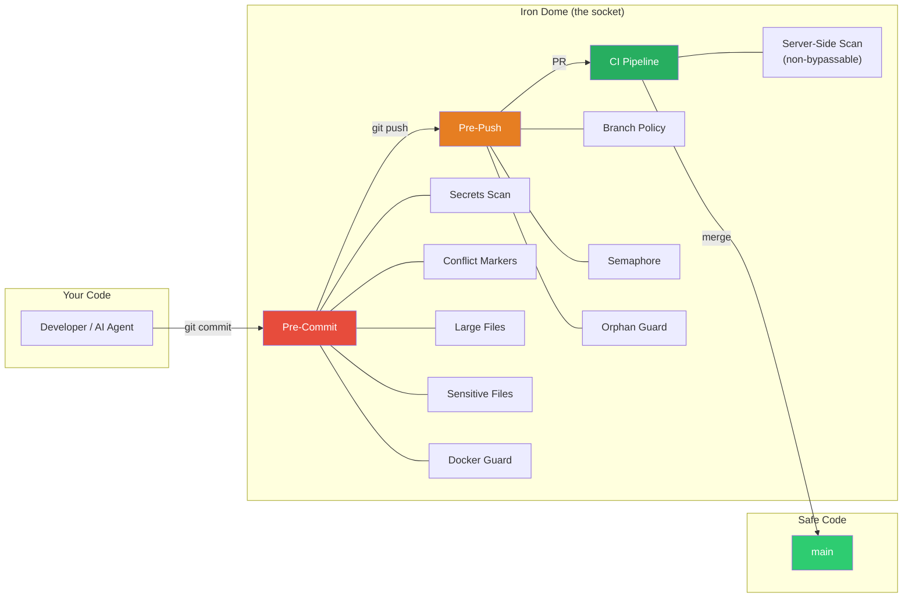
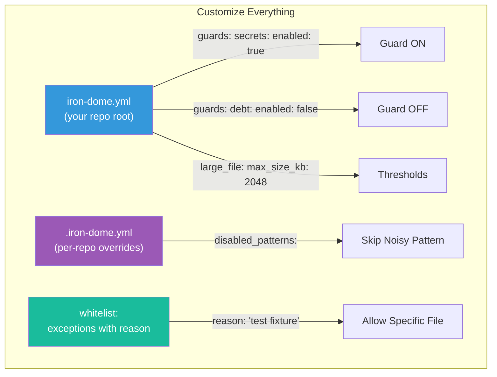

# Iron Dome

**Non-AI security for AI-assisted development.**

Iron Dome is a suite of composable git guards that protect your codebase from common mistakes made by AI coding assistants (Copilot, Cursor, Claude Code, Devin) and humans alike. It runs as git hooks (pre-commit, pre-push) and CI pipeline checks.

**The Dumb Guard philosophy**: Iron Dome uses zero AI. It's pure bash scripts with regex pattern matching. It cannot be prompt-injected, hallucinated, or socially engineered. When your AI agent tries to commit a secret, Iron Dome blocks it — no questions asked.

## How It Works

> *"Plug it in and it works. You don't need to understand electricity."*



**Three layers, zero gaps:**

| Layer | When | What | Bypassable? |
|-------|------|------|-------------|
| Pre-Commit | `git commit` | Scans staged files for secrets, conflicts, large files | Yes (`--no-verify`) |
| Pre-Push | `git push` | Blocks push to protected branches, checks semaphore | Yes (force push) |
| CI Pipeline | Pull Request | Same checks, server-side. **Catches all bypasses.** | No |



## Quick Start

```bash
# Clone Iron Dome
git clone https://github.com/hale-bopp-data/iron-dome.git ~/.iron-dome

# Add to PATH
echo 'export PATH="$HOME/.iron-dome:$PATH"' >> ~/.bashrc
source ~/.bashrc

# Install in your repo
cd your-project
iron-dome init

# Verify
iron-dome doctor
```

On a server (e.g., Ubuntu CI agent):

```bash
git clone https://github.com/hale-bopp-data/iron-dome.git /opt/iron-dome
export PATH="/opt/iron-dome:$PATH"
```

## What It Does

### Pre-Commit Guards (block bad commits)

| Guard | What it catches | Default |
|-------|----------------|---------|
| **Secrets Scan** | Hardcoded API keys, passwords, private keys, tokens | Enabled |
| **Conflict Markers** | Unresolved `<<<<<<<` `=======` `>>>>>>>` | Enabled |
| **Large File** | Files exceeding size limit (default 1MB) | Enabled |
| **Sensitive Files** | `.env`, `id_rsa`, `credentials.json` by filename | Enabled |
| **Docker Run** | `docker run` in scripts (enforces compose-only) | Opt-in |
| **Debt Tracker** | New TODO/FIXME/HACK introduced (advisory, never blocks) | Opt-in |

### Pre-Push Guards (block bad pushes)

| Guard | What it catches | Default |
|-------|----------------|---------|
| **Branch Policy** | Direct push to main/master/develop | Enabled |
| **Semaphore** | Push while another agent is working on the repo | Opt-in |
| **Orphan Guard** | Push to branch with already-merged PR | Opt-in |

### CI Pipeline (server-side mirror)

| Guard | What it checks | Platform |
|-------|---------------|----------|
| **Scanner** | All pre-commit checks, server-side (non-bypassable) | GitHub Actions, Azure Pipelines |

## Configuration

Iron Dome uses `iron-dome.yml` in your repo root. Run `iron-dome init` to create one with sensible defaults.

```yaml
guards:
  secrets:
    enabled: true
    severity: blocking
  large_file:
    enabled: true
    max_size_kb: 1024
  branch_policy:
    enabled: true
    protected_branches: ["main", "master"]
  semaphore:
    enabled: true  # Enable for multi-agent setups
```

### Per-Repo Overrides

Create `.iron-dome.yml` in any repo to customize without changing the main config:

```yaml
overrides:
  disabled_patterns:
    - "Generic API Key Assignment"  # Too many false positives in tests
  additional_patterns:
    - name: "Internal Token"
      pattern: 'myapp_[a-f0-9]{32}'
      severity: high
  docker_run:
    enabled: false  # This repo needs docker run for tests
```

## CLI Commands

```bash
iron-dome init              # Install hooks in current repo
iron-dome scan              # Scan changed files
iron-dome scan --all        # Scan all files
iron-dome doctor            # Diagnose installation
iron-dome stats             # Telemetry dashboard
iron-dome config            # Show active config
iron-dome help              # Show help
```

## Why "Dumb"?

In a world where AI writes code, AI-based security tools have a fundamental flaw: they can be manipulated by the same techniques they're trying to detect. A sufficiently creative prompt injection can convince an AI security scanner to ignore a threat.

Iron Dome is deliberately non-intelligent:
- **Bash scripts** — cannot be prompt-injected
- **Regex patterns** — deterministic, no hallucinations
- **Git hooks** — run locally before code leaves your machine
- **CI pipeline** — server-side mirror that catches `--no-verify` bypasses

The guard that can't be charmed is the guard that always works.

## Telemetry

Every Iron Dome intervention is logged to `~/.iron-dome/telemetry.jsonl`:

```json
{"ts":"2024-01-15T10:30:00","guard":"secrets","repo":"my-app","severity":"blocking","branch":"feat/api","detail":"AWS Access Key in config.js:42"}
```

Run `iron-dome stats` to see how many times Iron Dome saved your team.

## Whitelist (Auditable Exceptions)

Need to allow a specific file through a guard? Add it to the `whitelist` section in `iron-dome.yml` with a **mandatory reason**:

```yaml
whitelist:
  - file: "tests/fixtures/fake-credentials.json"
    guard: sensitive_files
    reason: "Test fixture with fake data, no real credentials"
    approved_by: "alice"

  - file: "docs/examples/api-demo.js"
    guard: secrets
    pattern: "Generic API Key Assignment"
    reason: "Documentation example with placeholder key"

  - file: "scripts/legacy-deploy.sh"
    guard: docker_run
    reason: "Legacy script pending migration to compose"
    expires: "2025-06-01"  # Auto-reverts after this date
```

Every whitelisted file is logged to telemetry — no silent bypasses. Run `iron-dome stats` to audit all exceptions.

## Customization

**Everything is configurable.** Iron Dome ships with sensible defaults, but you control every aspect:

| What | Where | Example |
|------|-------|---------|
| Enable/disable guards | `iron-dome.yml` | `docker_run: { enabled: true }` |
| Secret patterns | `iron-dome.yml` | Add your own regex patterns |
| Protected branches | `iron-dome.yml` | `protected_branches: ["main", "develop"]` |
| File size limit | `iron-dome.yml` | `max_size_kb: 2048` |
| Sensitive filenames | `iron-dome.yml` | Add/remove filename patterns |
| Per-repo overrides | `.iron-dome.yml` | Disable noisy patterns for specific repos |
| Exceptions | `whitelist` section | Allow specific files with reason |
| Severity | Per guard | `blocking` (stops commit) or `advisory` (warns only) |

Run `iron-dome config` to see the active configuration for the current repo.

## CI Integration

Iron Dome runs locally via git hooks **and** server-side in CI pipelines. Even if a developer runs `git commit --no-verify`, the CI pipeline catches it.

### GitHub Actions

```yaml
# .github/workflows/ci.yml
jobs:
  iron-dome:
    uses: hale-bopp-data/iron-dome/.github/workflows/iron-dome.yml@main
```

### Azure Pipelines

**Option A — Universal (self-contained, zero setup):**

Copy `src/ci/azure-pipelines-universal.yml` into your project. It clones Iron Dome on-the-fly — works on any hosted or self-hosted agent:

```yaml
# Create a pipeline pointing to this file, then add as Build Validation Policy
# Project Settings > Repos > <repo> > Policies > main > Build Validation
```

**Option B — Template reference (if Iron Dome is a repo resource):**

```yaml
resources:
  repositories:
    - repository: iron-dome
      type: github
      name: hale-bopp-data/iron-dome
      endpoint: github-connection

stages:
  - template: src/ci/azure-pipelines-template.yml@iron-dome
    parameters:
      scanMode: 'changed-only'
```

**Option C — Pre-installed on self-hosted agent (fastest):**

```bash
# On your build agent:
git clone https://github.com/hale-bopp-data/iron-dome.git /opt/iron-dome
```

The universal pipeline auto-detects `/opt/iron-dome` and uses it without cloning.

## Environment Variables

| Variable | Purpose |
|----------|---------|
| `IRON_DOME_HOME` | Installation directory |
| `IRON_DOME_SESSION` | Current session ID (semaphore) |
| `IRON_DOME_AGENT` | Current agent name (semaphore) |
| `IRON_DOME_BRANCH_SKIP=1` | Bypass branch policy |
| `IRON_DOME_SEMAPHORE_SKIP=1` | Bypass semaphore |
| `IRON_DOME_ORPHAN_SKIP=1` | Bypass orphan guard |

## Requirements

- **bash** 4+ (Git Bash on Windows, native on macOS/Linux)
- **git** 2.x+
- **grep** with `-P` flag (GNU grep or ripgrep)
- **python3** (optional: needed for `stats`, `semaphore`, `orphan` guard)

## Origin

Iron Dome was born inside [EasyWay](https://github.com/easyway-data), a platform where 41 AI agents collaborate on a polyrepo codebase. When you have that many autonomous agents writing code, you need a security gate that:

1. Cannot be tricked by prompt injection
2. Works without human supervision
3. Catches mistakes before they enter the codebase
4. Measures its own effectiveness (telemetry)

We built Iron Dome to be that gate. Now it's yours.

## License

MIT
